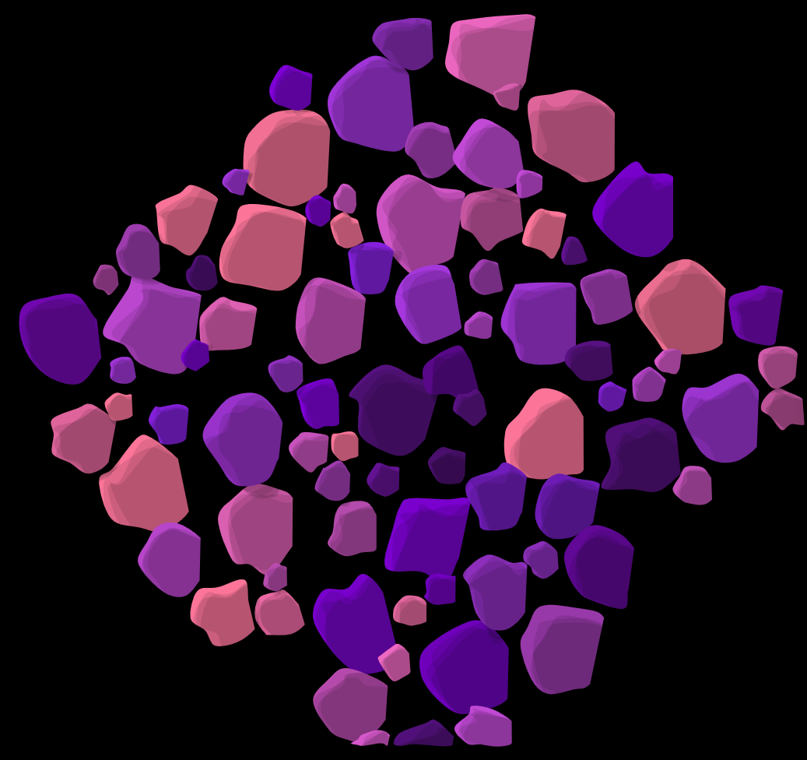
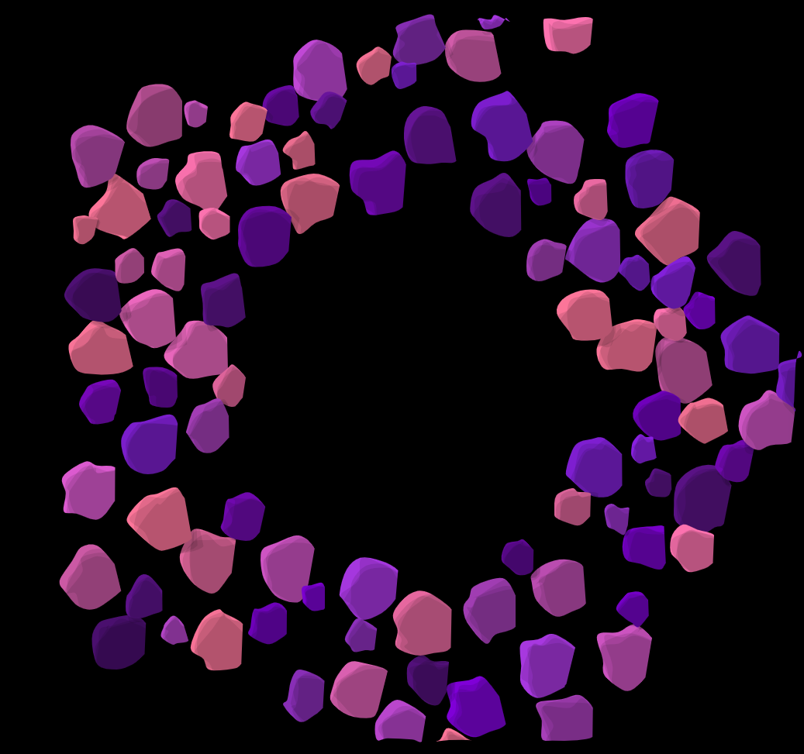
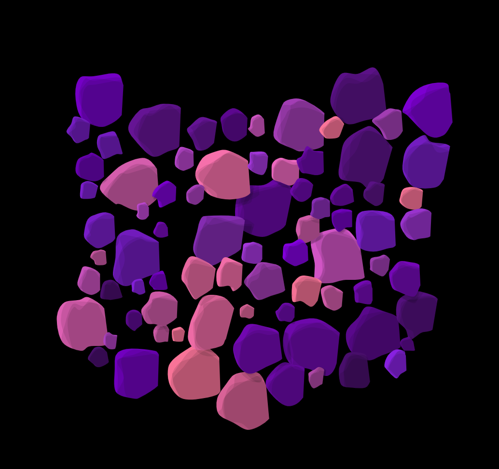

# Blob
|  | Details |
| -------| ---------|
| Prompt | **Blob** |
| Challenge | #WCCChallenge |
| Year | 2022 |
| Week | 35 of 2022 (29.Aug.2022 - 04.Sept.2022) |

## Version 1:
Circle packing customized for blobs with a basic light theme.  

## Version 2:
A darker purple theme with lighting layers.  

## Version 3:
Form polygon shapes with the blobs

## Version 4:
Form hollow polygons with blobs. (like asteroid belt)

## Version 5:
Form a corner wall with blobs (Using a custom polygon)
